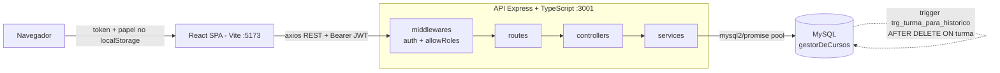
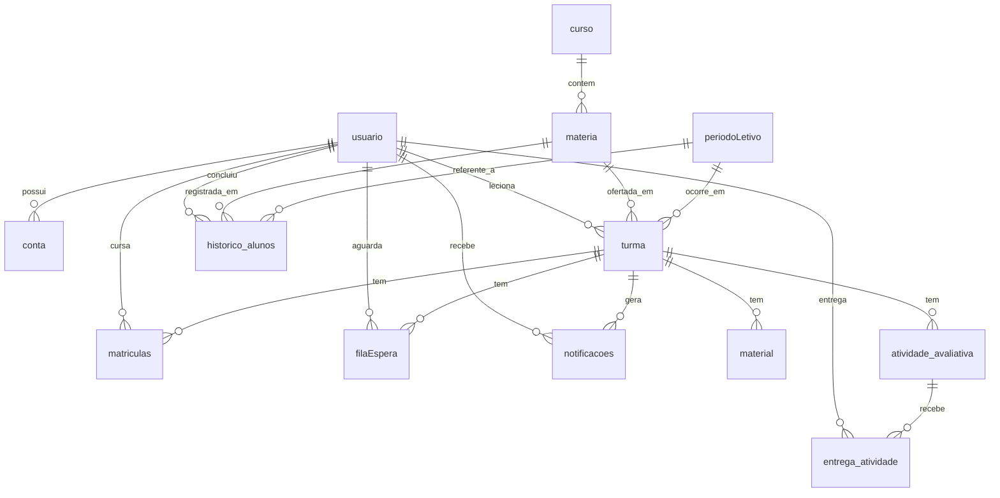

# Gestor de Cursos

Sistema web de gestão acadêmica com perfis de administrador, professor e aluno, matrícula em turmas com fila de espera priorizada, lançamento de notas e histórico escolar.


> **Contexto:** trabalho acadêmico individual (T2) da disciplina de Banco de Dados. O foco é modelagem relacional, SQL escrito à mão (JOIN/GROUP BY/HAVING, trigger) e regras de negócio acadêmicas; a aplicação full-stack existe para exercitar e demonstrar o modelo de dados.
>
> **Status:** roda apenas localmente. Não há deploy, demo pública ou pipeline de CI/CD configurados.

<!-- TODO: adicionar screenshot/gif aqui -->
<!--
  Sugestões de captura (nesta ordem):
  1. Tela de login
  2. Dashboard do administrador (gestão de usuários / cursos / turmas)
  3. Fluxo do aluno: matrícula em uma turma lotada -> entrada na fila de espera
  4. Dashboard do professor: notificação de fila cheia + lançamento de notas
-->

---

## Sobre o projeto

O sistema modela a operação acadêmica de uma instituição: o administrador cadastra usuários, cursos, disciplinas, períodos letivos e turmas (associando cada turma a um professor e a um limite de vagas); o professor gerencia materiais, atividades avaliativas e notas das suas turmas; o aluno se matricula em turmas abertas, entrega atividades dentro do prazo, consulta notas e acompanha seu histórico com as médias finais de cada matéria cursada. As permissões de cada operação são derivadas do papel do usuário.

A decisão de modelagem central é a separação entre **pessoa** e **credencial**: a tabela `usuario` guarda os dados pessoais (PK = CPF) e a tabela `conta` guarda matrícula, senha e `tipo` (`administrador` / `professor` / `aluno`). Assim uma mesma pessoa pode ter mais de uma conta e acumular papéis (ser aluno e professor ao mesmo tempo) sem duplicar dados pessoais, e a regra "um professor não pode se matricular como aluno em turma que ele leciona" é verificável comparando CPFs. A matrícula em turma é um processo em duas etapas: o aluno sempre entra primeiro na `filaEspera`, com **prioridade calculada pelo número de reprovações dele naquela matéria** (consultado em `historico_alunos`); quando a data de fechamento da fila chega, as vagas são preenchidas por ordem de prioridade. Se a turma lota e ainda há alunos na fila, o sistema gera uma `notificacao` para o professor avaliar o aumento de vagas.

No backend, o SQL é escrito diretamente com `mysql2/promise` (sem ORM), organizado em camadas `routes → controllers → services`, com autenticação e autorização isoladas em middlewares (`auth` valida o JWT; `allowRoles` compara o claim `tipo` do token com os papéis permitidos na rota). O arquivamento de turmas encerradas é feito no banco: um **trigger** (`trg_turma_para_historico`) intercepta o `DELETE` na tabela `turma` e materializa cada matrícula em `historico_alunos`, derivando a situação (`aprovado` / `pf` / `reprovado`) a partir das notas — a regra de histórico fica no banco e independe do código da aplicação. Os relatórios administrativos (`report-service.ts`) concentram as consultas analíticas: contagem de alunos por turma, média por período, alunos abaixo da média, professor com mais turmas, top 3 turmas por desempenho, usuários que são aluno e professor, e aluno com mais matérias concluídas.

---

## Tecnologias

**Backend (`Back/`)**
- Node.js + TypeScript 5.9
- Express 5
- MySQL via `mysql2/promise` (pool de conexões, SQL manual)
- `jsonwebtoken` para autenticação (JWT Bearer)
- `cors`, `dotenv`
- `nodemon` + `ts-node` para desenvolvimento

**Frontend (`Front/`)**
- React 19 + Vite 7 (`@vitejs/plugin-react-swc`)
- React Router DOM 7
- Axios (com interceptor que injeta o token)
- `jwt-decode`
- ESLint 9

**Banco de dados**
- MySQL 8+ (o dump `db.sql` foi gerado no MySQL 9.5)
- 13 tabelas + 1 trigger (`db.sql`)
- Modelo físico em `DER.mwb` (MySQL Workbench)

---

## Como rodar localmente

### Pré-requisitos
- Node.js ≥ 20.19 (exigência do Vite 7) e npm
- MySQL 8+ em execução
- Dois terminais (backend e frontend rodam separados)

### 1. Clonar

```bash
git clone https://github.com/vini3006/GestorDeCursos.git
cd GestorDeCursos
```

### 2. Criar e popular o banco

O nome do schema precisa ser exatamente `gestorDeCursos` (o `db.sql` não contém `CREATE DATABASE`/`USE`, e o backend se conecta a esse nome).

```bash
mysql -u root -p -e "CREATE DATABASE gestorDeCursos CHARACTER SET utf8mb4;"
mysql -u root -p gestorDeCursos < db.sql
```

O `db.sql` foi gerado por `mysqldump` de um servidor com GTID e binlog ativos, então traz as linhas `SET @@SESSION.SQL_LOG_BIN=0` e `SET @@GLOBAL.GTID_PURGED=...`. Em um MySQL local padrão (GTID desativado) a importação **aborta** nessas linhas. Nesse caso, importe filtrando-as:

```bash
grep -vE 'SQL_LOG_BIN|GTID_PURGED' db.sql | mysql -u root -p gestorDeCursos
```

O dump cria as 13 tabelas, o trigger `trg_turma_para_historico` e insere uma conta de administrador de exemplo (matrícula e senha estão no `INSERT INTO conta` dentro do `db.sql`). Use essa conta no primeiro login para cadastrar os demais usuários, ou insira a sua diretamente na tabela `conta`.

Observações:

- As credenciais de acesso ao MySQL são **fixas** em `Back/src/config/database.ts` (`host: localhost`, `user: root`, `password: root`, `database: gestorDeCursos`). Ajuste esse arquivo se o seu MySQL usar outros valores. Importe com o mesmo usuário que a API usará (`root`), já que o dump executa `SET @@SESSION.SQL_LOG_BIN`, que exige privilégio de administrador.
- O trigger é criado com `DEFINER=\`root\`@\`%\``. Se a sua instância só tiver `root@localhost`, o arquivamento de turma (`DELETE FROM turma`) pode falhar com `ERROR 1449`; crie a conta `root@%` ou edite o `DEFINER` no `db.sql` antes de importar.

### 3. Backend

```bash
cd Back
npm install
cp .env.example .env      # edite e defina JWT_SECRET
npm run dev               # nodemon + ts-node -> http://localhost:3001
```

O `.env` do backend precisa de:

| Variável         | Uso                                                        |
|------------------|-----------------------------------------------------------|
| `JWT_SECRET`     | chave para assinar/verificar os tokens (obrigatória)     |
| `JWT_EXPIRES_IN` | presente no `.env`, mas a expiração está fixada em `2h` no código |

### 4. Frontend

```bash
cd Front
npm install
npm run dev              # Vite -> http://localhost:5173
```

A URL da API é fixa em `Front/src/services/api.js` (`http://localhost:3001/`).

### 5. Usar

Abra `http://localhost:5173`, faça login com a conta administrador do dump e cadastre os demais usuários, cursos, disciplinas, períodos e turmas a partir do painel de administração.

---

## Arquitetura

Aplicação em três camadas: SPA React → API REST → MySQL. O estado de autenticação vive no `localStorage` do navegador (token + papel); cada requisição da SPA carrega o token no header `Authorization`, e a API valida e autoriza por rota.



### Modelo de dados (principais entidades)



### Estrutura de pastas

```
GestorDeCursos/
├── Back/                         API REST (Express + TypeScript)
│   └── src/
│       ├── app.ts                bootstrap do Express, registro das rotas (porta 3001)
│       ├── config/database.ts    pool mysql2 (credenciais fixas)
│       ├── middlewares/          auth (JWT) e roles (allowRoles)
│       ├── routes/               1 arquivo por recurso
│       ├── controllers/          validação de request/response
│       ├── services/             regras de negócio + SQL
│       │   ├── queue-service.ts        fila de espera e prioridade
│       │   ├── notification-service.ts notificações ao professor
│       │   └── report-service.ts       consultas analíticas / relatórios
│       └── models/               classes de domínio (User, Account, Class, ...)
├── Front/                        SPA (React 19 + Vite)
│   └── src/
│       ├── routes/route.jsx      rotas por caminho (/admin, /professor, /student)
│       ├── services/api.js       instância axios + interceptor de token
│       ├── components/           headers por perfil
│       └── pages/                dashboards e telas de admin/professor/aluno
├── db.sql                        dump MySQL: schema + trigger + admin de exemplo
├── DER.mwb                       modelo físico (MySQL Workbench)
└── REQUISITOS DO SISTEMA.txt     requisitos originais do trabalho
```

### Superfície da API

Todas as rotas (exceto `POST /users/login`) exigem JWT. O papel entre parênteses é validado por `allowRoles`.

| Prefixo          | Destaques                                                                                     |
|------------------|----------------------------------------------------------------------------------------------|
| `/users`         | `login`; `me`; CRUD de usuários/contas (admin); atualização do próprio perfil                 |
| `/course`        | listar; criar/excluir (admin); atualizar (admin, professor)                                   |
| `/subject`       | listar; criar/atualizar/excluir (admin)                                                       |
| `/semester`      | CRUD de períodos letivos (admin)                                                              |
| `/class`         | criar turma (admin); matricular / entrar na fila, entregas, notas (aluno); materiais, atividades, avaliação (professor); `processQueue/:idTurma` (admin, professor) |
| `/notifications` | notificações não lidas e gestão da fila de espera — aceitar/rejeitar (professor)              |
| `/reports`       | relatórios analíticos (admin)                                                                 |

---

## Funcionalidades por perfil

**Administrador** — cadastra e gerencia usuários (com múltiplos papéis), cursos, disciplinas e períodos letivos; cria turmas com professor, limite de vagas e data de fechamento da fila; acessa todos os relatórios.

**Professor** — vê suas turmas; cadastra materiais e atividades avaliativas com prazo; lança notas (P1, P2, PF, com média final calculada); recebe notificação quando uma turma lota com fila pendente; aceita ou rejeita alunos da fila de espera.

**Aluno** — entra na fila de turmas abertas (prioridade por reprovações anteriores na matéria); professor não pode se matricular como aluno na própria turma; acessa materiais e atividades apenas das turmas em que está matriculado; entrega atividades dentro do prazo; consulta notas e o histórico com médias finais.

---

## Limitações conhecidas

Pontos que ficaram fora do escopo do trabalho e seriam os próximos passos:

- Senhas são armazenadas e comparadas em texto plano (`conta.senha`); o correto seria hash (bcrypt/argon2).
- Credenciais do MySQL estão fixas em `Back/src/config/database.ts` em vez de virem do `.env`.
- `processQueue/:idTurma` e o arquivamento de turmas encerradas são disparados manualmente — não há job agendado.
- Sem testes automatizados e sem script de build/start de produção no backend.
- A autorização por papel é feita no backend; o frontend não possui rotas protegidas (qualquer caminho é acessível digitando a URL, embora a API recuse a requisição).
